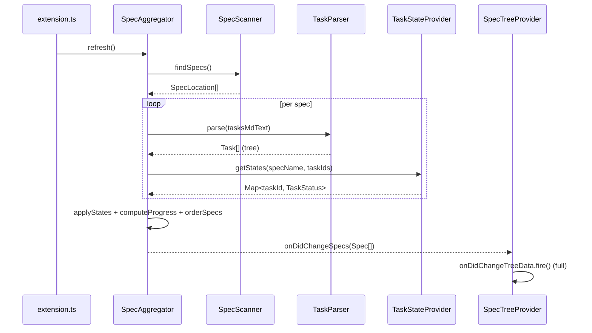
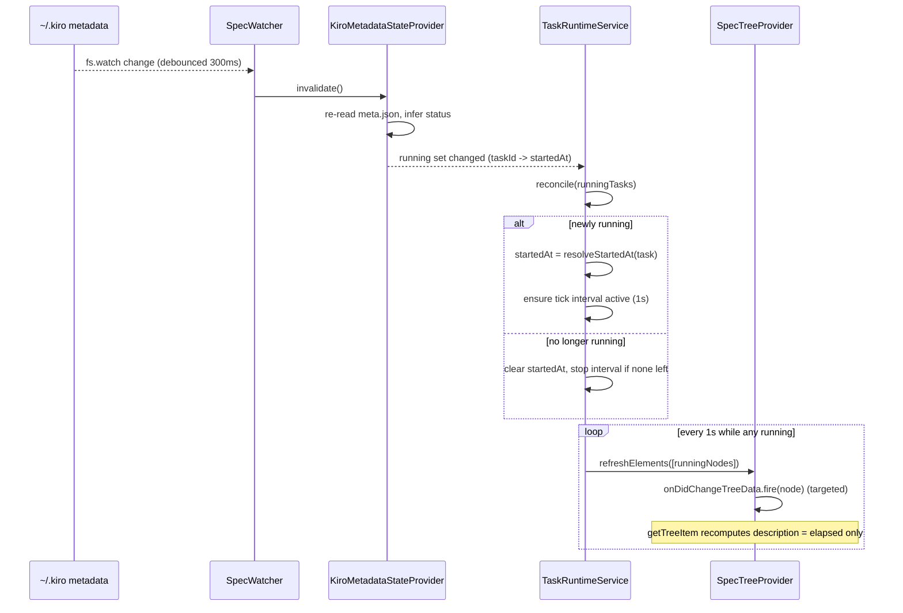

# Design Document: Kiro Spec Monitor

## Overview

Kiro Spec Monitor is a community (independent, **not** official Kiro/AWS) VS Code–compatible extension that renders a live, read-only view of Kiro Specs and their tasks inside the IDE. It mirrors the spirit of Kiro's "WORKFLOW RUNS" panel: the developer gets a sidebar tree showing every spec, its task hierarchy, per-task completion state, and — when it can be reliably detected — which tasks are currently running, with a live elapsed timer. The goal is to remove the need to manually watch `tasks.md`.

V1 is strictly a **monitor**: it never executes tasks, never writes to `tasks.md`, and never writes to Kiro's internal metadata under `~/.kiro`. It observes two sources — the workspace `.kiro/specs/**/tasks.md` files (the authoritative source of task structure and completion) and Kiro's internal, unofficial execution metadata under the user home (`~/.kiro/spec-sessions` and `~/.kiro/tasks`) — and reflects their state visually.

The central design tension is that Kiro exposes **no official API** for task-running state. "Running" can only be inferred heuristically from internal files that may change across Kiro versions. The architecture therefore isolates that uncertainty behind a pluggable `TaskStateProvider` abstraction: the UI depends only on an abstract `completed | running | pending` state (extensible to `failed | paused | blocked | skipped` in V2), and if no trustworthy running source exists the provider simply never emits `running` — the tree still works perfectly with a completed/pending fallback. This keeps the UI stable regardless of how (or whether) running detection evolves.

## Architecture

The extension is layered: file/metadata **sources** feed **services** that produce normalized domain models, a single **TreeDataProvider** renders them, and **commands** drive navigation. Nothing is dumped into `extension.ts` — it only wires modules together.

```mermaid
graph TD
    subgraph Workspace
        TMD[".kiro/specs/**/tasks.md"]
    end
    subgraph UserHome["~/.kiro (INTERNAL, READ-ONLY)"]
        SS["spec-sessions/<workspaceId>.json"]
        TM["tasks/<workspaceId>/<spec>.meta.json"]
    end

    TMD -->|read| SpecScanner
    TMD -->|parse| TaskParser
    SpecScanner --> TaskParser
    TaskParser -->|Spec/Task models| Aggregator

    SS -->|read-only| TSP[TaskStateProvider]
    TM -->|read-only| TSP
    TSP -->|completed/running/pending| Aggregator

    TM -->|startedAt via timestamps| RT[TaskRuntimeService]
    RT -->|elapsed ticks| TreeProvider

    FW1[FileSystemWatcher: tasks.md] -->|debounced| Aggregator
    FW2["fs.watch: ~/.kiro metadata"] -->|debounced| TSP

    Aggregator -->|ordered Spec[]| TreeProvider[SpecTreeProvider]
    TreeProvider -->|TreeItems| View["Activity Bar View: KIRO SPEC MONITOR"]

    View --> Commands
    Commands -->|openTask/reveal| Editor[VS Code Editor]

    classDef ro fill:#2d2d2d,stroke:#888,color:#ddd;
    class SS,TM,UserHome ro;
```

### Layer responsibilities

| Layer | Module(s) | Responsibility |
|-------|-----------|----------------|
| Models | `models/Spec.ts`, `models/Task.ts` | Pure data shapes, no I/O |
| Services | `services/specScanner.ts` | Discover `tasks.md` files under `.kiro/specs/` |
| | `services/taskParser.ts` | Parse `tasks.md` text → `Task[]` tree (pure, testable) |
| | `services/taskStateProvider.ts` | Abstract state source → `completed/running/pending`; concrete `KiroMetadataStateProvider` + `FallbackStateProvider` |
| | `services/specWatcher.ts` | FileSystemWatcher + `fs.watch` wiring, debounced change events |
| | `services/taskRuntimeService.ts` | Per-task `startedAt`, elapsed computation, tick scheduling, `workspaceState` persistence |
| | `services/workspaceIdResolver.ts` | Resolve the opaque `<workspaceId>` for the current workspace |
| | `services/specAggregator.ts` | Compose scanner + parser + state provider into ordered `Spec[]`; owns progress calc |
| Providers | `providers/specTreeProvider.ts` | `TreeDataProvider<TreeNode>`; targeted refresh for timer updates |
| Commands | `commands/*.ts` | Refresh, Open tasks.md, Reveal Task, Collapse All, Open Spec Folder |
| Entry | `extension.ts` | Activation: construct services, register view/commands/watchers, dispose on deactivate |

### Why native TreeView over WebView (V1)

A native `TreeView` gives us theme-correct `ThemeIcon`s (light/dark), built-in expansion/selection state, free keyboard accessibility, and — critically — **targeted element refresh** via `onDidChangeTreeData.fire(element)`. That lets the timer repaint a single running row without reparsing files or collapsing the tree. A WebView would force us to re-implement all of that and manage flicker manually. WebView is deferred to V2 if graphical progress bars are needed.

## Sequence Diagrams

### Initial load / full refresh



### Running detection + live timer



## Components and Interfaces

### Component: SpecScanner

**Purpose**: Locate every spec by finding `tasks.md` under `.kiro/specs/*/`.

```typescript
export interface SpecLocation {
  readonly name: string;        // spec folder name, e.g. "aimores-map"
  readonly specDir: vscode.Uri; // .kiro/specs/aimores-map
  readonly tasksFile: vscode.Uri; // .kiro/specs/aimores-map/tasks.md
}

export interface SpecScanner {
  /** Returns one entry per spec folder that contains a tasks.md. Never throws on a missing folder. */
  findSpecs(): Promise<SpecLocation[]>;
}
```

**Responsibilities**: glob `**/.kiro/specs/*/tasks.md` within workspace folders; tolerate workspaces without a `.kiro` directory (return `[]`).

### Component: TaskParser (pure, primary unit under test)

**Purpose**: Convert `tasks.md` text into a `Task[]` tree. No I/O, fully deterministic.

```typescript
export interface TaskParser {
  /** Pure. Deterministic. Same input text always yields the same Task[] tree. */
  parse(markdown: string): Task[];
}
```

### Component: TaskStateProvider (the key abstraction)

**Purpose**: Supply task state decoupled from its source. The UI depends only on this interface.

```typescript
export type TaskStatus =
  | 'completed'
  | 'running'
  | 'pending'
  // V2 extension points (never emitted in V1):
  | 'failed'
  | 'paused'
  | 'blocked'
  | 'skipped';

export interface TaskStateInfo {
  readonly status: TaskStatus;
  /** ms epoch of the most recent execution start, if the source can supply it. */
  readonly startedAt?: number;
  /** Raw executionStatus observed in metadata (e.g. "succeed"); surfaced for V2, unused by V1 UI. */
  readonly rawExecutionStatus?: string;
}

export interface TaskStateProvider {
  /**
   * Returns state for the given tasks of a spec.
   * MUST default to 'pending' for completed=false and 'completed' for checkbox [x].
   * MUST only return 'running' when it has a trustworthy signal. If unsure, return 'pending'.
   */
  getStates(specName: string, tasks: ReadonlyArray<Task>): Promise<Map<string, TaskStateInfo>>;

  /** Fired when the underlying source changes (debounced upstream). */
  readonly onDidChangeState: vscode.Event<void>;

  /** Drop any cache; next getStates re-reads the source. */
  invalidate(): void;
}
```

Two concrete implementations:

- **`KiroMetadataStateProvider`** — reads `~/.kiro/spec-sessions/<workspaceId>.json` and `~/.kiro/tasks/<workspaceId>/<spec>.meta.json`, infers running (see algorithm below). Degrades to pending/completed on any read/parse error.
- **`FallbackStateProvider`** — derives state purely from the `tasks.md` checkbox: `[x]` → completed, `[ ]` → pending. **Never** emits running. Used when metadata/workspaceId cannot be resolved.

> **Documented limitation.** There is no guaranteed `"status":"running"` field in Kiro's metadata. Running is inferred heuristically and may be wrong or unavailable, especially across Kiro versions. When confidence is not met, the provider returns `pending` and the timer stays inactive. The tree remains fully functional on the completed/pending fallback. Running is **never** guessed from "next pending task", a bare `[ ]`, "recently modified file", or "file is open".

### Component: TaskRuntimeService

**Purpose**: Own runtime (not logical) state: per-task `startedAt`, elapsed formatting, the single shared tick interval, and persistence across sidebar close/reopen.

```typescript
export interface RunningTaskRuntime {
  readonly taskKey: string;    // `${specName}::${taskId}`
  readonly startedAt: number;  // ms epoch
}

export interface TaskRuntimeService {
  /** Reconcile the full set of currently-running tasks (with optional source startedAt). */
  reconcile(running: ReadonlyArray<{ specName: string; task: Task; sourceStartedAt?: number }>): void;

  /** Elapsed ms for a running task, or undefined if not running. */
  getElapsed(specName: string, taskId: string): number | undefined;

  /** Fires with the set of TreeNodes needing a targeted repaint (every ~1s while any task runs). */
  readonly onTick: vscode.Event<ReadonlyArray<string /* taskKey */>>;

  dispose(): void;
}
```

**Responsibilities**: compute `startedAt` once per execution; persist `{ taskKey, startedAt, executionId }` to `context.workspaceState`; reuse persisted `startedAt` only when confident it's the **same** execution; run exactly one `setInterval(1s)` that is active only while ≥1 task is running; stop immediately when the running set empties.

### Component: WorkspaceIdResolver

**Purpose**: Resolve the opaque `<workspaceId>` (e.g. `6878d2513779f033`) correlating `~/.kiro/spec-sessions`, `~/.kiro/tasks`, and `~/.kiro/sessions` to the open workspace.

```typescript
export interface WorkspaceIdResolver {
  /** Best-effort resolution of the current workspace's Kiro workspaceId. undefined => use FallbackStateProvider. */
  resolve(): Promise<string | undefined>;
}
```

### Component: SpecAggregator

**Purpose**: Orchestrate scanner + parser + state provider into an ordered `Spec[]`; own progress calculation and spec ordering.

```typescript
export interface SpecAggregator {
  getSpecs(): ReadonlyArray<Spec>;
  refresh(): Promise<void>;
  readonly onDidChangeSpecs: vscode.Event<ReadonlyArray<Spec>>;
}
```

### Component: SpecTreeProvider

**Purpose**: Render the tree; perform targeted refreshes for timer ticks.

```typescript
export type TreeNode =
  | { kind: 'spec'; spec: Spec }
  | { kind: 'task'; specName: string; task: Task };

export class SpecTreeProvider implements vscode.TreeDataProvider<TreeNode> {
  readonly onDidChangeTreeData: vscode.Event<TreeNode | undefined | void>;
  getTreeItem(node: TreeNode): vscode.TreeItem;
  getChildren(node?: TreeNode): TreeNode[];
  getParent(node: TreeNode): TreeNode | undefined; // required for reveal()
  refreshElement(node: TreeNode): void;            // targeted
  refreshAll(): void;                              // full
}
```

### Localization (i18n)

All user-facing UI strings (tree labels, descriptions, tooltips, command titles, and messages) are localized to **Portuguese** and **English** only. Language is resolved from `vscode.env.language` using a prefix match: a value starting with `pt` (any variant, e.g. `pt`, `pt-br`) resolves to Portuguese; a value starting with `en` (any variant) resolves to English; any other value falls back to **English as the default**. The extension ships only the Portuguese and English bundles — no other languages are provided.

Localization uses VS Code's standard mechanism: command titles and other declarative `package.json` contributions use `package.nls.json` / `package.nls.pt.json`, and runtime strings use `vscode.l10n` bundles (`l10n/bundle.l10n.json` for English and `l10n/bundle.l10n.pt.json` for Portuguese). Because the active language is read once at activation, a language change takes effect after an editor window reload (consistent with VS Code's own display-language behavior).

## Data Models

### Model: Task

```typescript
export interface Task {
  /** Task text WITHOUT the checkbox, trimmed — matches the metadata taskId key exactly.
   *  e.g. "12.3 Montar public/index.html ..." */
  readonly id: string;
  /** Display title (same text as id for V1; separated for future formatting). */
  readonly title: string;
  readonly status: TaskStatus;      // resolved by aggregator from TaskStateProvider
  readonly completed: boolean;      // raw checkbox [x]
  /** Dotted number if present, e.g. "12.2.1"; undefined for unnumbered tasks. */
  readonly number?: string;
  readonly line: number;            // 0-based line index in tasks.md (checkbox line)
  readonly level: number;           // nesting depth, 0 = top-level
  readonly requirements?: string[]; // from "*Requirements: 6.3, 6.4*"
  readonly children: Task[];
  readonly startedAt?: number;      // populated only when status === 'running'
}
```

**Validation rules**:
- `id` is non-empty and has no leading `- [ ] ` / `- [x] ` prefix.
- `level >= 0`; a child's `level` is strictly greater than its parent's.
- `completed === true` ⇒ `status !== 'running'`.
- `children` contains only genuine tasks (checkbox lines), never detail bullets.

### Model: Spec

```typescript
export interface Spec {
  readonly name: string;
  readonly path: string;        // spec dir fsPath
  readonly tasksFile: string;   // tasks.md fsPath
  readonly tasks: Task[];       // top-level tasks (tree roots)
  readonly total: number;       // count of tasks that COUNT toward progress (see rule)
  readonly completed: number;   // completed among counted tasks
  readonly progress: number;    // completed / total in [0,1]; 0 when total === 0
  readonly runningCount: number;
}
```

### Progress calculation rule (DECIDED & DOCUMENTED)

**Rule: count only leaf tasks** (tasks with `children.length === 0`). `progress = completedLeaves / totalLeaves`, defined as `0` when `totalLeaves === 0`.

**Rationale**: A parent task like `12 Build frontend` that only groups `12.1 … 12.4` is an organizational node, not a unit of work. Counting the parent *and* its children double-counts the same work and distorts the percentage (e.g. a 4-subtask parent would contribute 5 units). Leaves are the atomic, actually-executed units, matching how Kiro tracks execution per leaf task. A top-level task with **no** children is itself a leaf and counts normally. This keeps the denominator equal to the real number of actionable items.

A spec is "complete" iff `total > 0 && completed === total`.

## Algorithmic Pseudocode

### Parser algorithm (line-oriented, stack-based nesting)

The parser is a single forward pass. Each line is classified; task lines are pushed/popped on an indentation stack to build the tree; non-task lines attach metadata to the current task.

```typescript
// Line classification regexes (anchored, Unicode-friendly).
// A TASK line: optional indent, a list marker, a checkbox, then text.
const TASK_RE =
  /^(?<indent>[ \t]*)[-*]\s+\[(?<check>[ xX])\]\s+(?<body>.+?)\s*$/;

// Optional leading dotted number inside the body, e.g. "12.2.1 Title" or "3 Title".
const NUMBER_RE = /^(?<num>\d+(?:\.\d+)*)\s+(?<rest>.*)$/;

// A requirements annotation line: *Requirements: 6.3, 6.4*  (also _Requirements: ..._)
const REQ_RE = /^[ \t]*[*_]Requirements:\s*(?<reqs>[0-9.,\s]+)[*_]\s*$/i;

// A DETAIL bullet: a list item that is NOT a checkbox (pure "- text"). These are task
// details and MUST NOT become tasks.
const DETAIL_RE = /^[ \t]*[-*]\s+(?!\[[ xX]\])\S.*$/;
```

```pascal
ALGORITHM parse(markdown)
INPUT: markdown text
OUTPUT: roots : Task[]  (top-level tasks)

BEGIN
  lines  ← split markdown by newline
  roots  ← []
  stack  ← []          // entries: { task, indentWidth }
  current ← NULL        // last task created, for metadata attachment

  FOR lineIndex ← 0 TO len(lines) - 1 DO
    line ← lines[lineIndex]

    IF line matches TASK_RE THEN
      indentWidth ← expandedWidth(match.indent)   // tabs → 4 cols, spaces → 1
      body ← match.body
      completed ← (lowercase(match.check) = 'x')

      IF body matches NUMBER_RE THEN
        number ← match.num
      ELSE
        number ← UNDEFINED       // tasks without numbering are allowed
      END IF

      task ← Task{
        id: body, title: body, number: number,
        completed: completed, status: pending,   // status resolved later by aggregator
        line: lineIndex, level: 0, children: [], requirements: []
      }

      // Pop deeper-or-equal entries so the top of stack is this task's parent.
      WHILE stack not empty AND stack.top.indentWidth >= indentWidth DO
        pop(stack)
      END WHILE

      IF stack is empty THEN
        task.level ← 0
        roots.append(task)
      ELSE
        parent ← stack.top.task
        task.level ← parent.level + 1
        parent.children.append(task)
      END IF

      push(stack, { task: task, indentWidth: indentWidth })
      current ← task

    ELSE IF line matches REQ_RE AND current ≠ NULL THEN
      current.requirements ← splitAndTrim(match.reqs)      // ["6.3","6.4"]

    ELSE
      // DETAIL bullets, blank lines, multiline description continuation,
      // complementary prose between tasks → ignored for tree structure.
      // (DETAIL_RE deliberately never creates a task.)
      SKIP
    END IF
  END FOR

  RETURN roots
END
```

**Preconditions**: `markdown` is a string (may be empty).
**Postconditions**: returns a forest of tasks; every node's `line` is a valid 0-based index; parent/child `level` strictly increases; no detail bullet appears as a task; completed flag matches the checkbox.
**Loop invariant**: at the top of each iteration, `stack` holds exactly the chain of open ancestors ordered by strictly increasing `indentWidth`, and every task created so far is reachable from `roots`.

> **Edge cases handled**: `[X]` uppercase; `*`-style list markers; tab vs space indentation (normalized via `expandedWidth`); unnumbered tasks (`number` undefined); numbers at any depth (`1`, `12.1`, `12.2.1`); multiline descriptions and complementary prose (skipped); requirements lines (attached, not tasked); detail bullets (skipped). Malformed lines are skipped rather than throwing.

### Progress calculation

```pascal
ALGORITHM computeProgress(roots)
INPUT: roots : Task[]
OUTPUT: { total, completed, progress, runningCount }

BEGIN
  total ← 0; completed ← 0; runningCount ← 0

  FUNCTION walk(task)
    IF task.children is empty THEN      // LEAF — the only counted unit
      total ← total + 1
      IF task.completed THEN completed ← completed + 1 END IF
    ELSE
      FOR each child IN task.children DO walk(child) END FOR
    END IF
    IF task.status = running THEN runningCount ← runningCount + 1 END IF
  END FUNCTION

  FOR each root IN roots DO walk(root) END FOR

  progress ← IF total = 0 THEN 0 ELSE completed / total
  RETURN { total, completed, progress, runningCount }
END
```

**Postconditions**: `0 ≤ completed ≤ total`; `progress ∈ [0,1]`; `progress = 0` when `total = 0`; parents that only group children contribute 0 to `total`.

### Running inference (KiroMetadataStateProvider)

```pascal
ALGORITHM inferStatus(task, metaEntry)
INPUT: task (from tasks.md), metaEntry (from <spec>.meta.json, may be NULL)
OUTPUT: TaskStateInfo

BEGIN
  // 1. Checkbox is authoritative for completion.
  IF task.completed THEN
    RETURN { status: completed, rawExecutionStatus: metaEntry?.executionStatus }
  END IF

  // 2. No metadata => cannot know running => pending (safe fallback).
  IF metaEntry = NULL OR metaEntry.executionHistory is empty THEN
    RETURN { status: pending }
  END IF

  latest ← entry in metaEntry.executionHistory with MAX timestamp
  final  ← metaEntry.executionStatus      // e.g. "succeed", or absent

  // 3. A recorded final outcome means NOT running (V1 collapses to pending/completed).
  IF final is present AND final ≠ "" THEN
    // V2 will map "failed" here; V1 keeps the UI to pending when checkbox still [ ].
    RETURN { status: pending, rawExecutionStatus: final }
  END IF

  // 4. Heuristic running: unchecked, has execution history, no final status.
  //    Confidence is NOT guaranteed; this is the single, isolated inference point.
  RETURN { status: running, startedAt: latest.timestamp,
           rawExecutionStatus: UNDEFINED }
END
```

**Precondition**: `task.id` equals the metadata key (both are the checkbox-stripped task text).
**Postcondition**: returns `running` only in case 4; every other path returns `completed`/`pending`. Any thrown error upstream (missing file, bad JSON) is caught and the whole spec falls back to checkbox-only state.

### workspaceId resolution strategy

```pascal
ALGORITHM resolveWorkspaceId(workspaceFolder)
INPUT: workspaceFolder (first open folder) 
OUTPUT: workspaceId : string | UNDEFINED

BEGIN
  specNames ← folder names under <workspaceFolder>/.kiro/specs/
  IF specNames is empty THEN RETURN UNDEFINED END IF

  candidates ← list *.json files under ~/.kiro/spec-sessions/
  // Each file is <workspaceId>.json mapping specName -> chatSessionId.

  bestId ← UNDEFINED; bestScore ← 0
  FOR each file IN candidates DO
    id   ← basename(file) without ".json"
    map  ← parseJson(file)            // specName -> sessionId; skip on parse error
    score ← | keys(map) ∩ specNames |  // how many of OUR specs appear
    IF score > bestScore THEN
      bestScore ← score; bestId ← id
    END IF
  END FOR

  // Require at least one spec-name overlap to accept a correlation.
  IF bestScore ≥ 1 THEN RETURN bestId ELSE RETURN UNDEFINED END IF
END
```

**Rationale**: the `<workspaceId>` is opaque, but `spec-sessions/<id>.json` keys are our spec folder names. Matching those keys against the specs we actually scanned uniquely correlates the workspace without depending on any undocumented hashing of the folder path. Zero overlap ⇒ return `undefined` ⇒ `FallbackStateProvider` (pending/completed only). Resolution is re-attempted on refresh so a newly created spec can establish the correlation.

### Timer update strategy (no reparsing, no flicker)

```pascal
ALGORITHM onTick()   // fires once per second ONLY while runningKeys is non-empty
BEGIN
  FOR each taskKey IN runtime.runningKeys DO
    node ← treeNodeFor(taskKey)        // cached node reference, no file read
    emit onDidChangeTreeData(node)     // targeted: VS Code calls getTreeItem(node) only
  END FOR
END

ALGORITHM getTreeItem(node)   // for a running task node
BEGIN
  elapsedMs ← Date.now() - node.task.startedAt    // pure arithmetic, no I/O
  item.label       ← node.task.title              // unchanged → no structural churn
  item.description ← formatElapsed(elapsedMs)      // only this changes: "1m 42s"
  item.iconPath    ← ThemeIcon("sync~spin")
  RETURN item
END
```

**Why this avoids flicker/expansion loss**: firing `onDidChangeTreeData` with a specific `element` makes VS Code re-request only `getTreeItem` for that node — it does **not** rebuild children, so expansion state and selection are preserved. `getTreeItem` computes elapsed from the known `startedAt` with `Date.now()`; the parser and file reads never run on the tick. The interval exists only while something is running and is cleared the instant the running set empties.

```typescript
export function formatElapsed(ms: number): string {
  const totalSec = Math.floor(ms / 1000);
  const s = totalSec % 60, m = Math.floor(totalSec / 60) % 60, h = Math.floor(totalSec / 3600);
  if (h > 0) return `${h}h ${pad(m)}m`;          // 1h 03m
  if (m > 0) return `${m}m ${pad(s)}s`;          // 12m 38s / 1m 04s
  return `${s}s`;                                 // 12s / 58s
}
const pad = (n: number) => n.toString().padStart(2, '0');
```

## Key Functions with Formal Specifications

### `SpecAggregator.refresh()`

```typescript
async refresh(): Promise<void>
```
**Preconditions**: services constructed; workspace may have zero or more specs.
**Postconditions**: `getSpecs()` reflects the current `tasks.md` + state source; specs ordered per the ordering rule; `onDidChangeSpecs` fired exactly once; never writes any file; never throws (errors degrade a single spec to fallback state).

### `orderSpecs(specs)`

```typescript
function orderSpecs(specs: Spec[]): Spec[]
```
**Postconditions**: stable sort into three groups in order — (1) specs with `runningCount > 0`, (2) incomplete specs (`completed < total` or `total === 0`), (3) complete specs (`total > 0 && completed === total`); original relative order preserved within each group.

### `TaskRuntimeService.reconcile(running)`

```typescript
reconcile(running: ReadonlyArray<{ specName: string; task: Task; sourceStartedAt?: number }>): void
```
**Postconditions**: for each newly-running task, `startedAt` is set once (reused from `workspaceState` iff same `executionId`, else `sourceStartedAt`, else `Date.now()`); tasks no longer running have `startedAt` cleared and are removed from persistence; the tick interval is active iff the running set is non-empty.
**Loop invariant**: after processing, `runningKeys` equals exactly the set of taskKeys in `running`.

## Example Usage

```typescript
// extension.ts — wiring only.
export function activate(context: vscode.ExtensionContext): void {
  const resolver = new WorkspaceIdResolver(context);
  const stateProvider = createStateProvider(resolver, context); // Kiro meta or fallback
  const runtime = new TaskRuntimeService(context.workspaceState);
  const aggregator = new SpecAggregator(new SpecScanner(), new TaskParser(), stateProvider, runtime);

  const treeProvider = new SpecTreeProvider(aggregator, runtime);
  const view = vscode.window.createTreeView('kiroSpecMonitor.view', {
    treeDataProvider: treeProvider,
    showCollapseAll: true,
  });

  const watcher = new SpecWatcher(aggregator, stateProvider); // debounced tasks.md + ~/.kiro
  runtime.onTick(keys => treeProvider.onTick(keys));          // targeted repaint

  context.subscriptions.push(
    view, watcher, runtime,
    vscode.commands.registerCommand('kiroSpecMonitor.refresh', () => aggregator.refresh()),
    vscode.commands.registerCommand('kiroSpecMonitor.openTasksFile', openTasksFile),
    vscode.commands.registerCommand('kiroSpecMonitor.revealTask', revealTask),
    vscode.commands.registerCommand('kiroSpecMonitor.collapseAll',
      () => vscode.commands.executeCommand('workbench.actions.treeView.kiroSpecMonitor.view.collapseAll')),
    vscode.commands.registerCommand('kiroSpecMonitor.openSpecFolder', openSpecFolder),
  );

  aggregator.refresh();
}

// Click-to-navigate: command bound to each task TreeItem.
async function revealTask(node: { specName: string; task: Task }): Promise<void> {
  const spec = /* lookup by node.specName */;
  const doc = await vscode.workspace.openTextDocument(vscode.Uri.file(spec.tasksFile));
  const editor = await vscode.window.showTextDocument(doc);
  const pos = new vscode.Position(node.task.line, 0);
  editor.selection = new vscode.Selection(pos, pos);
  editor.revealRange(new vscode.Range(pos, pos), vscode.TextEditorRevealType.InCenter);
}
```

### Spec-level badge rendering

```typescript
// Spec TreeItem description
function specDescription(spec: Spec, runtime: TaskRuntimeService): string {
  if (spec.runningCount > 0) {
    // "🔄 2 running • 13/19 tasks"  (or single-task variant with elapsed)
    return `🔄 ${spec.runningCount} running • ${spec.completed}/${spec.total} tasks`;
  }
  const done = spec.total > 0 && spec.completed === spec.total;
  return done ? `✓ ${spec.completed}/${spec.total}` : `${spec.completed}/${spec.total}`;
}
```

## Correctness Properties

Expressed as universally-quantified statements; the parser and progress properties are the primary unit-test targets.

### Property 1: Parser — total parsing
∀ markdown: `parse(markdown)` terminates and returns an array (never throws).

**Validates: Requirements 2.1, 2.10**

### Property 2: Parser — clean task id
∀ task node `t` produced: `t.id` contains no `- [ ]`/`- [x]` prefix and equals the trimmed checkbox body (⇒ matches metadata key).

**Validates: Requirements 2.12**

### Property 3: Parser — child level increment
∀ parent `p`, child `c ∈ p.children`: `c.level = p.level + 1` and `c` was more deeply indented than `p` in source.

**Validates: Requirements 3.1, 3.2, 2.5**

### Property 4: Parser — detail bullets never become tasks
∀ line matching `DETAIL_RE` (non-checkbox bullet): it appears in **no** task's position (details never become tasks).

**Validates: Requirements 2.8, 3.4**

### Property 5: Parser — checkbox completion mapping
∀ task with checkbox `[x]`/`[X]`: `completed = true`; with `[ ]`: `completed = false`.

**Validates: Requirements 2.4**

### Property 6: Parser — determinism
Idempotence/determinism: `parse(m)` ≡ `parse(m)` for identical `m` (structurally equal trees).

**Validates: Requirements 2.1**

### Property 7: Parser — requirements attachment
∀ requirements line following a task: its numbers attach to the nearest preceding task's `requirements`, creating no node.

**Validates: Requirements 2.7**

### Property 8: Progress — bounds
∀ forest: `0 ≤ completed ≤ total` and `progress ∈ [0,1]`.

**Validates: Requirements 4.5**

### Property 9: Progress — no division by zero
`total = 0 ⇒ progress = 0` (no division by zero).

**Validates: Requirements 4.4**

### Property 10: Progress — leaves only counted
A parent task that only groups subtasks contributes 0 to `total` (only leaves counted).

**Validates: Requirements 4.1, 4.2**

### Property 11: Progress — completion
If every leaf is `[x]`, then `progress = 1` and the spec is "complete".

**Validates: Requirements 4.6**

### Property 12: State/running — completed is never running
∀ task with `completed = true`: `status ≠ running`.

**Validates: Requirements 8.2**

### Property 13: State/running — running inference source
`KiroMetadataStateProvider` emits `running` only via inference case 4 (unchecked, has executionHistory, no final executionStatus); `FallbackStateProvider` never emits `running`.

**Validates: Requirements 8.1, 8.5, 8.6, 8.7**

### Property 14: State/running — graceful degradation
On any metadata read/parse error, a spec's states equal the pure checkbox-derived states (graceful degradation).

**Validates: Requirements 13.5, 8.3**

### Property 15: Runtime/timer — interval activity
The tick interval is active ⟺ `runningKeys ≠ ∅`.

**Validates: Requirements 10.8, 10.4**

### Property 16: Runtime/timer — elapsed arithmetic
`getElapsed = Date.now() - startedAt` for running tasks; the parser is never invoked by a tick.

**Validates: Requirements 10.6, 13.3**

### Property 17: Runtime/timer — startedAt reuse
A persisted `startedAt` is reused ⟺ the current execution's `executionId` matches the persisted one; otherwise a fresh `startedAt` is used and no misleading time is shown.

**Validates: Requirements 10.5**

### Property 18: Ordering — stable grouped order
`orderSpecs` yields groups [running], [incomplete], [complete] in that order and is stable within each group.

**Validates: Requirements 11.1, 11.2**

### Property 19: Localization — language selection
∀ editor language L: if L starts with 'pt' the UI resolves to Portuguese; if L starts with 'en' or anything else the UI resolves to English (English is the default).

**Validates: Requirements 15.1, 15.2, 15.3, 15.4**

## Error Handling

| Scenario | Condition | Response | Recovery |
|----------|-----------|----------|----------|
| No workspace / no `.kiro` | `findSpecs()` returns `[]` | Show welcome/empty view, no error | Auto-updates when a spec appears (watcher) |
| `tasks.md` unreadable | read/parse fails for one spec | Skip that spec, log to output channel | Next change event retries |
| Malformed task line | line doesn't match `TASK_RE` cleanly | Line skipped by parser | N/A (by design) |
| `workspaceId` unresolved | zero spec-name overlap | Use `FallbackStateProvider` (pending/completed) | Re-resolved each refresh |
| Metadata file missing/bad JSON | `~/.kiro/tasks/...meta.json` fails | Spec degrades to checkbox-only state | Re-read on next debounced change |
| Kiro metadata format changed | inference yields nothing credible | No `running` emitted; timer inactive | Documented; isolated to provider |
| Persisted `startedAt` stale | `executionId` mismatch | Ignore persisted value, re-detect | Fresh `startedAt` |

All file reads are wrapped so a single failure never crashes activation or the refresh loop. A dedicated output channel ("Kiro Spec Monitor") records diagnostics without surfacing noisy notifications.

## Testing Strategy

### Unit testing (primary) — recommended runner: **vitest**

**Recommendation: vitest.** The parser, progress calc, state inference, `orderSpecs`, and `formatElapsed` are pure functions with no `vscode` dependency, so they can be tested in a fast Node environment without launching the Extension Host. vitest gives quick feedback, TS support out of the box, and simple watch mode for TDD. The thin `vscode`-dependent glue (providers, commands, watchers) is kept minimal and can be smoke-tested with the VS Code `@vscode/test-electron` runner later if needed, but V1's test weight is on the pure modules.

Key `taskParser` cases: top-level + multi-level subtasks; numbering `1`/`12.1`/`12.2.1`; unnumbered tasks; `[x]`/`[X]`/`[ ]`; tab vs space indent; multiline descriptions; `*Requirements: ...*` lines; detail bullets excluded; complementary prose between tasks; empty file; CRLF vs LF.

### Property-based testing

**Library: fast-check.** Generate random well-formed `tasks.md` (random nesting, checkboxes, numbering, interleaved detail bullets/prose) and assert the Correctness Properties above — notably: no detail bullet becomes a task (prop 4), `level` strictly increases (prop 3), progress bounds and leaf-only counting (props 8–10), determinism (prop 6). Also fuzz `formatElapsed` for monotonic, non-negative formatting.

### Integration testing

Lightweight `@vscode/test-electron` smoke test: activate the extension against a fixture workspace with sample specs, assert the tree renders the expected spec/task nodes and that `revealTask` opens the right file at the right line. No metadata mutation is performed (read-only guarantee asserted by never registering a write).

## Performance Considerations

- **No per-second reparsing**: timer computes elapsed arithmetically; parser runs only on debounced file changes.
- **Debounce** (~300ms) coalesces bursts of `tasks.md`/metadata writes during active editing/execution.
- **Targeted refresh** avoids full-tree rebuilds, preserving expansion/selection and eliminating flicker.
- **Single interval** shared by all running tasks; stopped when idle.
- Spec scanning uses `findFiles` with a scoped glob and excludes `node_modules`.

## Security Considerations

- **Strictly read-only** outside the extension's own `workspaceState`: no writes to `tasks.md` or to any `~/.kiro` file. The design registers no write/delete operations against those paths.
- `~/.kiro` metadata is **internal and unofficial**; treated as untrusted input — all JSON parsing is defensive, errors are swallowed into fallback behavior, and no values are executed.
- No network access. No telemetry. No external endpoints.
- The extension does not present itself as official Kiro/AWS software (name/description reflect community origin).

## Dependencies

- **Runtime**: none beyond the VS Code Extension API (`vscode`). No external runtime npm packages — all logic is first-party TypeScript.
- **Dev**: `typescript`, `@types/vscode`, `@types/node`, `vitest`, `fast-check`, `@vscode/test-electron` (integration smoke only), `esbuild` or `tsc` for bundling.
- **Engine**: targets the VS Code Extension API baseline shared by Kiro IDE; `engines.vscode` pinned to a conservative version for broad compatibility.

## V2 / Future Extension Points (out of scope for V1, hooks preserved)

The architecture leaves clean seams so V2 features need no UI rewrite:
- **New states** (`failed`, `paused`, `blocked`, `skipped`): already in the `TaskStatus` union; `rawExecutionStatus` is already captured from metadata (`executionStatus: "succeed"`). A richer `KiroMetadataStateProvider` maps these; `getTreeItem` adds icons.
- **Task execution** (Run/Run All/Pause/Cancel/Retry): new `commands/` + an optional `TaskController` service; the monitor-only providers remain unchanged.
- **Execution history / logs / duration**: `executionHistory[]` is already observed; a `HistoryService` can consume it.
- **Dependencies, filters, search, grouping, progress bars, recently-completed**: additive providers/decorations over the same `Spec[]`; a WebView view can be introduced alongside the TreeView if graphical bars are required.
